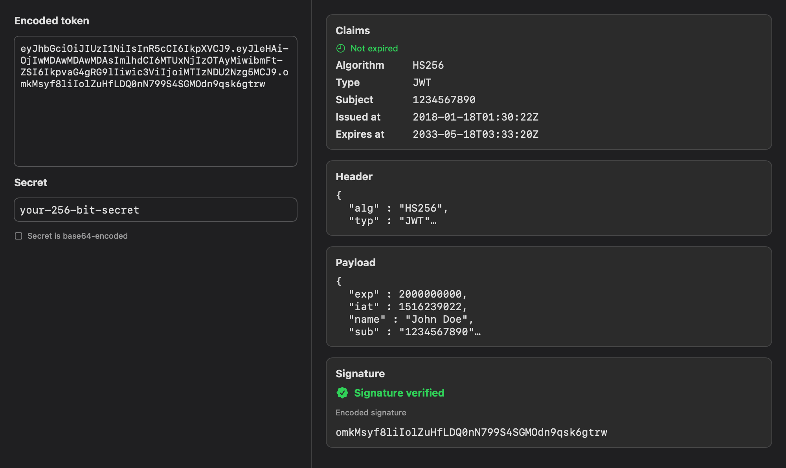

# JWTee

A small native macOS app for looking inside JSON Web Tokens — decode them, read
the claims, and check the signature — without pasting your signing secret into a
website you don't control.



## Why

I kept reaching for jwt.io to sanity-check tokens, and every time I needed to
verify a signature I had to type my secret into a web page. Even if that page is
trustworthy, it's a habit worth breaking. JWTee does the same job as a regular
Mac app: nothing is uploaded, and your secret never leaves your machine.

## What it does

Paste a token and it splits apart instantly — the header and payload are
pretty-printed, and the claims that actually matter (who issued it, who it's
for, when it was issued, and when it expires) are pulled out into a summary so
you're not squinting at raw JSON. Expired or not-yet-valid tokens are flagged.

To check a signature, type the secret into the field on the left. The
**Signature** section tells you whether it's valid — green if it matches, red if
it doesn't. It handles the HMAC family (HS256/384/512), and the secret can be
plain text or base64. Tokens signed with other algorithms still decode fine;
JWTee just won't claim to have verified something it can't.

Everything runs locally and offline. Nothing about the token or the secret is
ever sent anywhere.

## Getting it

There's no notarized download yet, so you build it once from source. You'll need
Xcode:

```sh
git clone https://github.com/basselshurbaji/jwtee.git
cd jwtee
open jwtee.xcodeproj      # then press ⌘R to run
```

That's it — the app opens and you can paste a token straight away.

---

## Under the hood

The signing/verification logic lives in a standalone `JWTCore` framework with no
UI, which the SwiftUI app is a thin layer over. That split is what keeps the
behavior testable.

There are two ways to build, pointed at the same sources:

- **Xcode** (`jwtee.xcodeproj`) — three targets: `JWTCore` (framework), `jwtee`
  (the app, which links and embeds the framework), and `jwteeTests`. Build/run
  from the IDE, or:
  ```sh
  xcodebuild -scheme jwtee -destination 'platform=macOS' build
  ```
- **Swift Package** (`Package.swift`) — handy for the command line:
  `swift run jwtee` and `swift test`.

**Tests.** Behavior is covered by 38 tests written with Apple's
[swift-testing](https://developer.apple.com/documentation/testing) — base64url
round-trips, malformed-token handling, the canonical jwt.io token as external
ground truth, HS256/384/512 round trips, tampered payloads, unsupported
algorithms, secret encodings, and `exp`/`nbf` validity with an injected clock.
Run them with ⌘U in Xcode or:

```sh
swift test
```

> If `swift test` reports `no such module 'Testing'`, your command-line tools are
> pointed at the standalone CLT instead of Xcode. Fix with
> `sudo xcode-select -s /Applications/Xcode.app/Contents/Developer`.

**Signature algorithms.** Verification supports the HMAC family — HS256, HS384,
HS512 — using CryptoKit with a constant-time comparison. The algorithm is read
from the token header; `alg: none` and asymmetric algorithms (RS*/ES*/PS*) are
reported as unsupported rather than verified, since those need a public key
rather than a shared secret.
